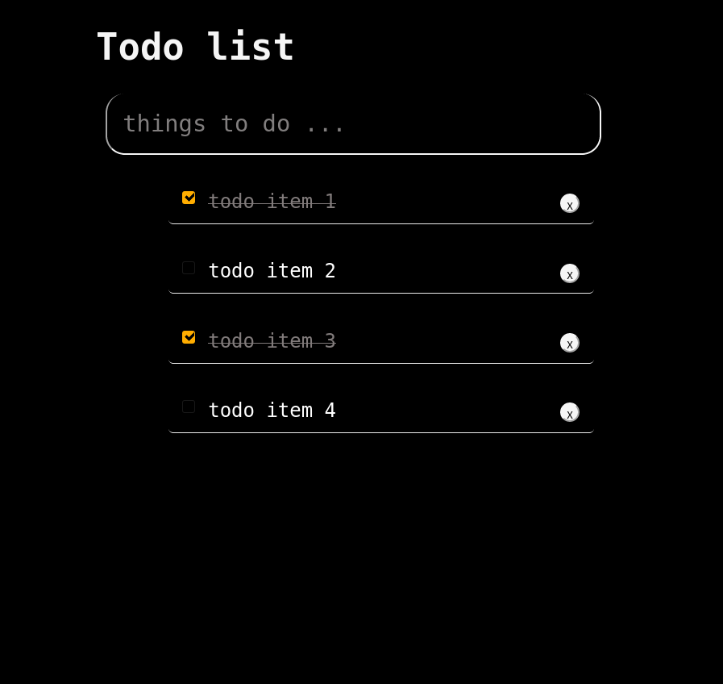

* * *
# Simple CRUD Elm-App

### Simple todo app written in Elm : 

1. Create, Update, Delete
2. JavaScript InterOP using Ports
3. Persistent LocalStorage
4. Model-View-Update 

* * *
  
### Steps to run the app

[ 1 ] . Compile and download the dependencies :

```SHELL

elm make src/Main.elm --optimize --output elm.js

```

[ 2 ] . Open the `Index` Markup file in your favourite Browser.

* * *

* * *